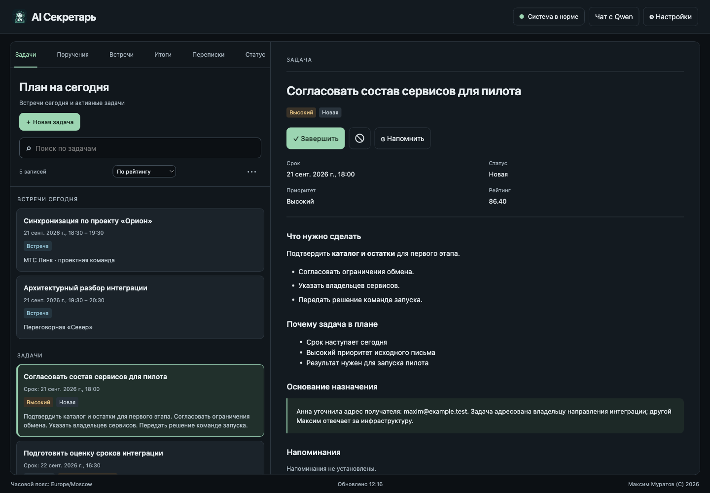
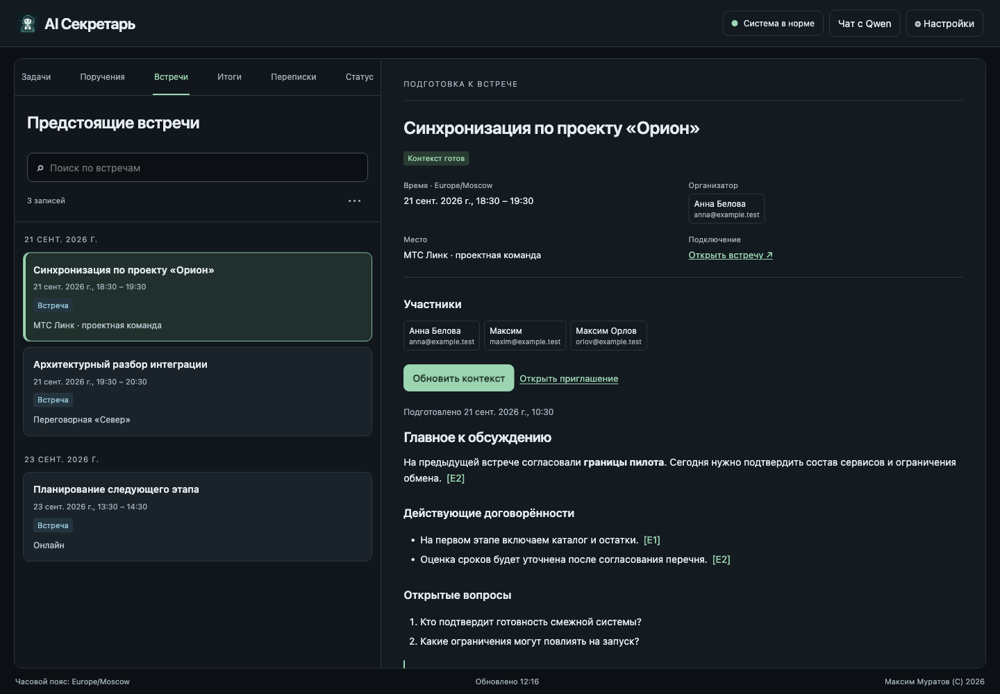
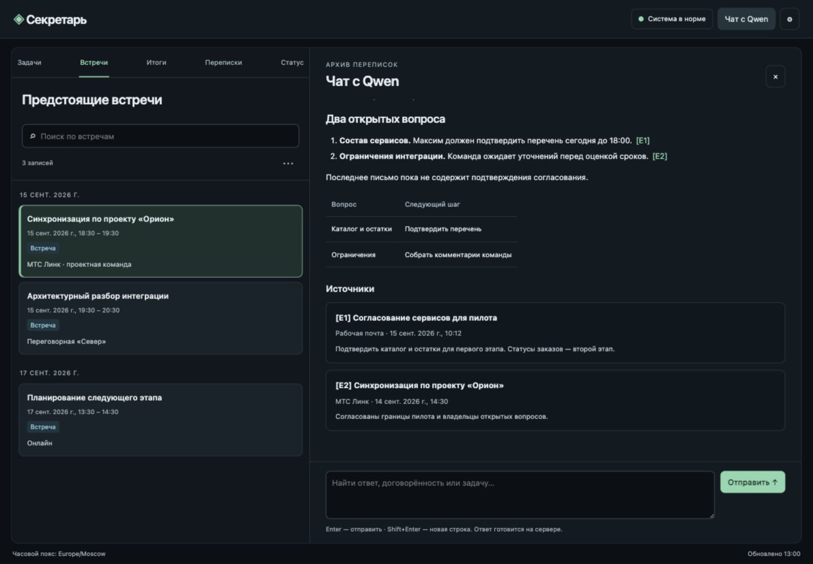
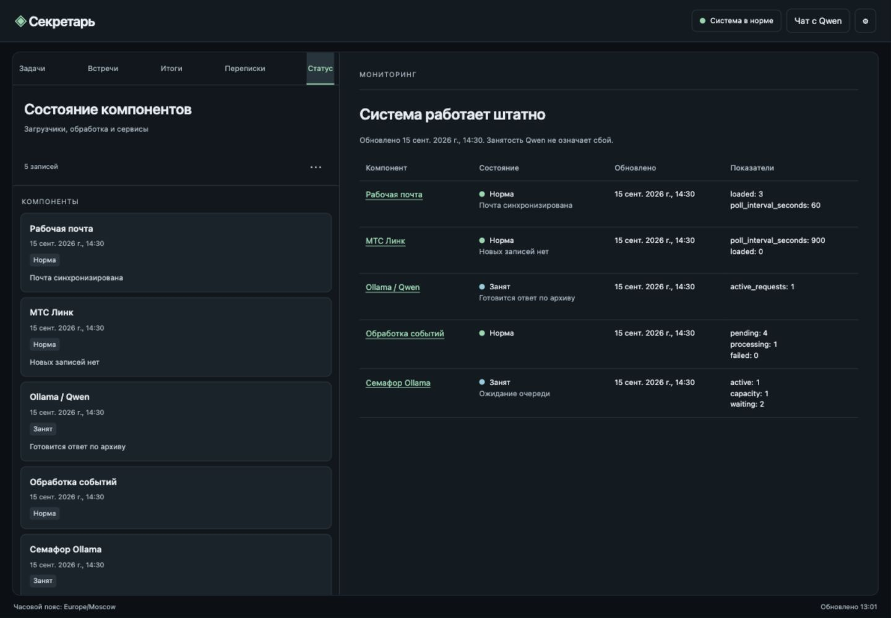
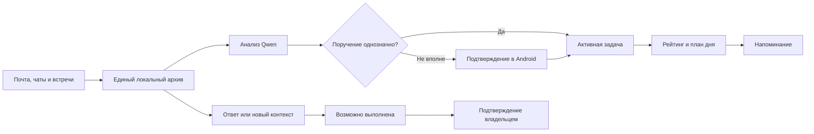

<p align="center">
  
</p>

<h1 align="center">Серкетарь</h1>

<p align="center">
  <strong>Персональный AI-секретарь, который хранит ваши секреты у вас.</strong><br>
  Превращает почту, переписки и встречи в понятные задачи, следит за сроками
  и помогает не терять договорённости.
</p>

<p align="center">
  Self-hosted · Local-first · Qwen + Ollama · Android · WEB · Python · Kotlin
</p>

---

## Переписка заканчивается. Обязательства остаются

Рабочая задача редко приходит как аккуратно оформленная карточка в таск-трекере.
Чаще она спрятана в длинном письме, упомянута в чате, сформулирована одной фразой
на встрече или появляется в присланных после неё итогах. Затем начинаются поиски:
кто что обещал, когда это нужно сделать и был ли уже отправлен ответ.

**Серкетарь** собирает этот разрозненный поток в единую персональную картину дня.
Локальная Qwen понимает контекст, выделяет поручения именно для владельца системы,
определяет приоритет и срок, а Android-приложение превращает результат в удобный
список действий.

Это не ещё один почтовый клиент и не обычный список дел. Это связующее звено между
разговором и выполнением.

## Что берёт на себя Серкетарь

| Возможность | Что получает пользователь |
|---|---|
| **Задачи из переписки** | Поручения из писем и сообщений автоматически превращаются в задачи со ссылкой на оригинал. |
| **Контроль уверенности** | Очевидное поручение создаётся сразу, неоднозначное сначала предлагается подтвердить. |
| **План на сегодня** | В 08:00 готов ранжированный список с учётом приоритета, срока и просрочки. |
| **Контроль выполнения** | Ответ в переписке может перевести задачу в состояние «возможно выполнена», а окончательное решение остаётся за пользователем. |
| **Встречи и договорённости** | Предстоящие встречи, расшифровки и присланные участниками итоги собраны в связанных представлениях. |
| **Живые резюме переписок** | Каждая нитка получает краткое резюме, которое обновляется вместе с новыми сообщениями. |
| **Поиск и диалог с архивом** | Встроенный чат с Qwen отвечает по сохранённым письмам, сообщениям, задачам и результатам встреч. |
| **Умные уведомления** | На телефоне видно тип события, название и краткое описание задачи; нажатие открывает её детали. |
| **Голосовой ввод** | Долгое нажатие на `+` позволяет надиктовать задачу вместе со сроком и приоритетом. |

При извлечении поручений ответственный определяется отдельно для каждого пункта.
Отметки вида «отв. Сидоров А.» проверяются по фамилии, инициалам и адресам участников:
явные поручения другому человеку не попадают даже в список подтверждения. При тёзках
и неполных данных назначение требует подтверждения. Цитируемая история письма служит
контекстом и сама по себе не создаёт старые задачи повторно.

## WEB-интерфейс

WEB открывается по `/app/` на том же HTTPS-сервере, что и мобильное приложение.
В браузере нужен действующий клиентский сертификат mTLS. Задачи, встречи,
переписки и история Qwen общие с Android; настройки доступны по `/admin`.

Слева остаются вкладки, поиск и список. Выбор записи обновляет область чтения
справа, как в Outlook. Панели прокручиваются независимо. Поиск выполняется по
серверному архиву, а выбранная запись и запрос сохраняются в ссылке страницы.
На узком экране двухпанельная компоновка сохраняется с горизонтальной прокруткой.

Примеры ниже сняты с реализованного интерфейса на **синтетических данных**.
Имена, адреса, сообщения и показатели не относятся к рабочему архиву.

**Задачи и основание назначения.** Приоритет, срок, причины ранжирования и
первоисточник доступны рядом со списком. Задачу можно создать, подтвердить,
отклонить, завершить или добавить напоминание.



**Подготовка к встрече.** Контекст содержит решения, открытые вопросы и ссылки
на материалы. Будущая встреча готовится по кнопке; готовый контекст можно обновить.
Предыдущая версия остаётся доступной во время подготовки новой.



**Чат с Qwen.** Ответы поддерживают Markdown и таблицы, источники открываются
в области чтения. Вопросы сохраняются в серверной очереди; можно отправить
следующий вопрос, пока предыдущий обрабатывается.



<details>
<summary>Состояние компонентов</summary>

Загрузчики, Ollama, обработка и семафор представлены таблицей с показателями.
Общий индикатор постоянно виден в заголовке. Занятость Qwen сохраняет зелёный
общий индикатор; проблемы и потеря связи обозначаются отдельно.



</details>

Обновление происходит через WebSocket после сохранения изменений на сервере.
Открытые список, детали и чат обновляются автоматически; черновики и позиция
прокрутки сохраняются. При восстановлении связи данные синхронизируются заново.
Если WebSocket недоступен, включается резервный опрос. Ручное обновление через
меню `⋯`, `Alt+R` или оттягивание списка остаётся доступным.
Свайп по списку переключает соседние вкладки.
Браузерные push при закрытой странице и полноценный офлайн-режим в этот выпуск
не входят; действующая доставка уведомлений на Android сохраняется.

Для разработки и проверок WEB см. [web/README.md](web/README.md).

## Мобильный интерфейс

Скриншоты Android-приложения 0.4.4 сняты с эмулятора Pixel 9a на отдельной
тестовой базе PostgreSQL с вымышленными задачами, встречами и переписками.

<p>
  
  
  
</p>

[Все 12 экранов и замечания по отображению](assets/mobile/README.md).
Красный общий индикатор на этих снимках относится к тестовому окружению:
Ollama в нём не запускалась, внешние источники отключены.

В новой версии Android соединение WebSocket существует только пока приложение
видимо. В фоне уведомления доставляет Firebase; при возвращении все экраны
получают актуальные данные. Подробнее: [каналы обновления](REALTIME.md).

## Один поток — от сообщения до результата



Система сохраняет происхождение решения. Из карточки задачи можно перейти к
исходному письму или сообщению, увидеть автора, тему, дату, время и доказательный
фрагмент. Резюме помогает быстро вспомнить контекст, а оригинал позволяет проверить
вывод модели.

## Рабочий день без ручной сортировки

Утром Серкетарь формирует план на сегодня. В течение дня новые критические задачи
сразу попадают в него, приближающиеся сроки поднимаются выше, а незавершённые задачи
на следующий рабочий день ранжируются заново.

Сроки понимаются не только как календарные даты. Формулировки вроде «завтра»,
«к пятнице» или «до конца дня» интерпретируются в настроенном часовом поясе, в
границах рабочего времени и с учётом производственного календаря России.

Пользователь при этом сохраняет контроль: задачу можно создать или отредактировать
вручную, назначить напоминание, изменить приоритет и подтвердить выполнение.

## Встреча не заканчивается на последнем слайде

Серкетарь отделяет календарные события от обычной переписки и связывает материалы
одной встречи:

- событие из календаря Outlook;
- расшифровку МТС Линк;
- автоматически сформированное локальной Qwen резюме;
- решения и договорённости;
- присланные участниками письма с итогами;
- задачи, которые появились по результатам обсуждения.

На плитке видна короткая выжимка, а в деталях — время, тема, участники, общее резюме
и отдельные комментарии участников. Повторяющиеся встречи учитываются как реальные
экземпляры календаря, а будущая встреча не может случайно оказаться среди итогов.

## Приватность — часть архитектуры

Серкетарь создавался как персональная self-hosted-система. Письма, сообщения,
расшифровки, вложения, смысловые индексы и результаты анализа остаются на локальном
сервере. По умолчанию Qwen работает через вашу Ollama. При выборе внешнего
OpenAI-совместимого API контекст для анализа отправляется на указанный сервер модели.

В серверном режиме доступ к API защищён TLS и обязательным клиентским сертификатом для каждого
Android-устройства. Пароли источников, API_KEY модели и серверный ключ Firebase хранятся в базе в
зашифрованном виде. Firebase используется только для доставки технического сигнала
с типом события и непрозрачным идентификатором; текст задачи приложение получает
напрямую с персонального сервера по mTLS.

## Подключаемые источники

В текущем MVP поддерживаются:

- почта по IMAP, включая входящие и отправленные сообщения;
- локальный Microsoft Exchange через EWS;
- календарь Outlook, в том числе повторяющиеся встречи;
- готовые расшифровки МТС Линк;
- PDF, DOCX и XLSX-вложения с текстовым содержимым;
- универсальный защищённый endpoint для следующих адаптеров чатов и коммуникационных платформ.

Источники подключаются через веб-панель. Там же настраиваются теги, исключённые
адреса и стоп-фразы, параметры локальной модели, рабочий календарь и уведомления.
Рассылки, ответы о принятии встреч и автоответы об отсутствии распознаются отдельно,
чтобы не засорять задачи и рабочие переписки.

## Для кого этот продукт

Серкетарь особенно полезен руководителям, архитекторам, владельцам продуктов,
консультантам и специалистам, у которых решения распределены между несколькими
почтовыми ящиками и регулярными встречами, а цена забытой договорённости выше цены
ручного ведения ещё одного списка.

Проект рассчитан на одного владельца и 2–3 его Android-устройства. Это осознанный
фокус: вместо ролей, организаций и общей облачной базы — персональный контекст,
локальный интеллект и полный контроль над данными.

## Чем отличается от обычного таск-трекера

| Обычный список задач | Серкетарь |
|---|---|
| Ждёт ручного ввода | Находит обязательства в уже существующей коммуникации |
| Хранит только карточку | Сохраняет связь с исходным контекстом и оригиналом |
| Не понимает, был ли дан ответ | Отслеживает продолжение переписки и признаки выполнения |
| Показывает заданный порядок | Повторно ранжирует задачи по важности и сроку |
| Отделён от встреч | Связывает календарь, расшифровку, итоги и поручения |
| Часто зависит от облачного AI | Анализирует содержимое локальной Qwen через Ollama |

## Статус проекта

Серкетарь находится на стадии работающего персонального MVP. Серверный контур
разворачивается через Docker Compose, Android-клиент устанавливается как подписанный
APK, а основные сценарии — синхронизация, анализ, задачи, встречи, поиск, чат и
push-уведомления — уже объединены в сквозной процесс.

Следующие направления развития: новые адаптеры мессенджеров, OCR сканов,
расширенные поисковые воронки по тегам и дальнейшее улучшение качества локального
анализа.

---

# Техническая документация

Серкетарь — персональная система выделения задач из почты, чатов и расшифровок
встреч. Анализ выполняется через Ollama либо OpenAI-совместимый API (LLMOps / vLLM);
серверные компоненты приложения запускаются Docker Compose.

Полный контекст продукта и зафиксированные ограничения находятся в
[REQUIREMENTS.md](REQUIREMENTS.md).

Для собственных парсеров и интеграций доступен идемпотентный
[API внешних источников задач](EXTERNAL_TASK_API.md).

Развёртывание в корпоративном контуре МТС с Qwen через LLMOps описано в
[README_MTS.md](README_MTS.md).

Внешние загрузчики могут публиковать heartbeat, ошибки и числовые метрики через
[API состояния компонентов](COMPONENT_STATUS_API.md).

## Быстрый запуск серверного контура

Для работы только в браузере на своём компьютере используйте
[локальный WEB-режим](#локальный-web-режим). Мобильное приложение для него не требуется.

1. Создайте bootstrap-секреты и локальное окружение:

   ```bash
   mkdir -p secrets
   openssl rand -base64 32 > secrets/postgres_password
   openssl rand -base64 48 > secrets/app_master_key
   cp .env.example .env
   ```

   `app_master_key` шифрует учётные данные источников. Храните его в защищённой
   резервной копии: при потере ключа сохранённые пароли расшифровать нельзя.

2. Убедитесь, что отдельно запущенная Ollama доступна контейнерам. По умолчанию
   контейнеры приложения обращаются к `http://ollama:11434` через приватную
   Docker-сеть. Адрес можно изменить в веб-панели.

3. Для локальной проверки с тестовыми сертификатами запустите:

   ```bash
   docker compose up -d --build
   ```

4. Импортируйте сгенерированный клиентский сертификат и откройте
   `https://<PUBLIC_HOST>/admin`. В панели задаются пользователь, календарь,
   модель, уведомления и все источники переписки. YAML-конфигурация приложению
   больше не требуется.

   Для LLMOps в разделе «Анализ и рабочий день → Модель» выберите
   «OpenAI-совместимый (LLMOps / vLLM)», укажите базовый URL API (например,
   `https://llm.example.com/v1`), точное имя модели и `API_KEY`. Ключ передаётся
   как `Authorization: Bearer …` для анализа, чата и проверки доступности модели.
   Поддерживаются структурированные JSON-ответы и потоковый чат.
   Сохранённый ключ не возвращается в браузер: пустое поле сохраняет прежнее значение,
   новый ключ заменяет его, отдельная отметка удаляет его при сохранении настроек.

5. Проверьте состояние:

   ```bash
   docker compose ps
   docker compose logs api worker
   ```

6. Запустите backend-тесты:

   ```bash
   docker compose run --rm --no-deps -v ./backend/tests:/tests:ro \
     api python -m unittest discover -s /tests -v
   ```

Публичная установка должна использовать публично доверенный серверный TLS-сертификат и отдельную клиентскую CA. Тестовый PKCS#12 создаётся с паролем `changeit` и не предназначен для production.

### Локальный WEB-режим

Работа через браузер на одном компьютере поддерживается без Android, Firebase,
DNS-имени и клиентских сертификатов. API публикуется только на `127.0.0.1:8000`.
Изменения в открытом интерфейсе приходят через WebSocket. Подключения к выбранной
модели и источникам данных используют их обычные сетевые адреса.

Для новой установки подготовьте секреты из корня репозитория (Bash):

```bash
set -e
umask 077
mkdir -p secrets
chmod 700 secrets
if [ ! -s secrets/postgres_password ]; then
  openssl rand -base64 32 > secrets/postgres_password
  chmod 444 secrets/postgres_password
fi
if [ ! -s secrets/app_master_key ]; then
  openssl rand -base64 48 > secrets/app_master_key
  chmod 444 secrets/app_master_key
fi
```

Файлы читаются внутри контейнеров разными UID; на хосте их защищает закрытый каталог
`secrets`. Существующие секреты сохраняются. Резервная копия `app_master_key` нужна
для восстановления зашифрованных паролей и API_KEY.

Если этот же Compose-проект раньше работал в серверном режиме, перед локальным
запуском остановите его сетевые сервисы, сохранив базу и volumes:

```bash
docker compose -f compose.yaml -f compose.local-web.yaml \
  --profile network-services stop proxy cert-init extensions
```

Запуск:

```bash
docker compose -f compose.yaml -f compose.local-web.yaml up -d --build
```

- Приложение: <http://127.0.0.1:8000/app/>.
- Настройки: <http://127.0.0.1:8000/admin>.
- Готовность сервера: <http://127.0.0.1:8000/health/ready>.

Compose запускает PostgreSQL, миграции, API, worker и парсер документов. Caddy,
генератор сертификатов и контейнер внешних загрузчиков по умолчанию выключены.
`LOCAL_WEB_ONLY=true` задаётся для backend-сервисов через override и отключает
Firebase, включая ранее настроенные push-уведомления. В панели остаются настройки
модели, источников и рабочего расписания. Режим запуска нельзя переключить через API настроек.

Не объединяйте `compose.local-web.yaml` с корпоративным или Let's Encrypt override.
Для локального режима не включайте профиль `network-services`. HTTP-доступ
предназначен для браузера на том же компьютере; доступ с других компьютеров
настраивается через серверный вариант с HTTPS/mTLS.

Для остановки локального экземпляра:

```bash
docker compose -f compose.yaml -f compose.local-web.yaml stop
```

### Локальный debug-режим без TLS

Для временной отладки API и веб-панель можно опубликовать только на loopback Mac:

```bash
docker compose -f compose.yaml -f compose.debug.yaml up -d
docker compose stop proxy
```

Панель будет доступна на `http://localhost:8000/admin`. Этот режим предназначен
только для локальной диагностики сервера. Android debug- и release-сборки по
умолчанию используют HTTPS и mTLS. Рабочий URL задаётся локально в игнорируемом
файле `android/secretary.local.properties`.

### Публичный сертификат

Сертификат Let's Encrypt, выпущенный через DNS-01 challenge, хранится локально в
`secrets/letsencrypt`. Рабочий `compose.letsencrypt.yaml` также является локальным
файлом и не попадает в Git. Для подключения сертификата к Caddy на целевом сервере:

```bash
docker compose -f compose.yaml -f compose.letsencrypt.yaml up -d
```

Вместе с проектом на сервер необходимо безопасно перенести весь каталог
`secrets/letsencrypt`, поскольку файлы в `live/` являются ссылками на `archive/`.
Ручной DNS-сертификат автоматически не продлевается: challenge нужно повторить
до окончания срока либо настроить DNS API-плагин провайдера.

### Рабочий deployment

Исходники остаются локально. Адрес сервера, SSH-пользователь и целевой каталог
задаются вне репозитория. После изменений на сервер синхронизируются только
исходники и публичная Compose-конфигурация, затем нужные образы пересобираются.

```bash
docker compose -f compose.yaml -f compose.letsencrypt.yaml up -d --build
```

Persistent volumes PostgreSQL и приложения, `/opt/secretary/secrets` и отдельно
запущенный контейнер Ollama при таком обновлении не заменяются и не очищаются.

Интеграции размещаются в `extensions/` и собираются отдельным
`extensions/Dockerfile`. Контейнер `extensions` включён в основной Compose.
Для обновления только расширений на `192.168.9.108`:

```bash
bash infra/deploy-extensions.sh
```

Скрипт использует SSH (`DEPLOY_HOST`, `DEPLOY_USER`, `DEPLOY_DIR`), запускает тесты,
переносит исходники расширений и публичный Compose, затем пересобирает только
контейнер `extensions`. Настройка Bearer-авторизации Tabs и mTLS Секретаря описана в
[инструкции расширения](extensions/tasks_tabs_new_services/README.md).

## Компоненты

Браузерное расширение **AI Секретарь** находится в [browser-extension/](browser-extension/README.md).
Сборка: `python3 browser-extension/build.py`; ZIP: `dist/ai-secretary-extension.zip`.
Перед локальным запуском или упаковкой backend выполните сборку расширения.
В Docker Compose она выполняется автоматически.

- `proxy` — Caddy, TLS и обязательный mTLS;
- `api` — FastAPI и встроенная веб-панель администрирования;
- `worker` — синхронизация и LLM-конвейер;
- `extensions` — импорт новых согласований сервисов из Tabs каждые 15 минут;
- `db` — PostgreSQL;
- `document-parser` — изолированное извлечение текста из PDF/DOCX/XLSX;
- Ollama — внешняя локальная зависимость и в Compose не входит;
- `android` — Kotlin-клиент.

## Реализованный объём MVP

- синхронизация входящих и отправленных писем IMAP;
- синхронизация inbox/sent локального Exchange через EWS (NTLM/basic/digest);
- синхронизация готовых расшифровок МТС Линк по наблюдаемому API, их повторный анализ Qwen без
  готового резюме МТС и отдельная Android-вкладка результатов встреч;
- определение присланных по почте итогов состоявшихся встреч, их самостоятельное отображение
  при отсутствии расшифровки и автоматическое объединение с результатом МТС Линк при совпадении;
- отдельный Android-экран результата встречи: время, тема, участники, общее Qwen-резюме,
  договорённости и раздельные резюме писем участников с переходом к оригиналам;
- универсальный mTLS endpoint приёма событий для будущих адаптеров чатов и встреч;
- извлечение задач Qwen через внешний Ollama со структурированным JSON;
- пакетная Qwen-классификация почтовых рассылок: они сохраняются в архиве и поиске, но
  исключаются из задач и вкладки переписок;
- кандидаты на подтверждение и состояние «возможно выполнена»;
- ранжирование, план на 08:00, ручные и автоматические напоминания;
- безопасное извлечение текста из PDF, DOCX и XLSX в изолированном контейнере;
- Android-кэш Room, создание/завершение/подтверждение задач, просмотр исходного сообщения,
  отдельный экран деталей нитки переписки, напоминания, FCM-синхронизация и чат с Qwen по
  архиву задач и переписки;
- сохранение всех событий переписки независимо от результата выделения задачи, гибридный поиск
  по подготовленному смысловому индексу и оригиналам, проверка релевантности Qwen и потоковая
  выдача ответа с подтверждёнными источниками;
- настройка сервера и подключение IMAP/Exchange/МТС Линк через веб-панель;
- хранение рабочих настроек в PostgreSQL и шифрование паролей адаптеров и Firebase JSON.

## МТС Линк: корпоративная SSO-авторизация

Подключение настраивается в `/admin` для источника типа **МТС Линк** со шлюзом
`https://gw.mts-link.ru`. Для входа через корпоративный SSO используется расширение
**AI Секретарь** для Chrome/Edge 118+. После входа сервер сохраняет access token и
refresh token и автоматически обновляет access token. Интервал опроса задаётся
отдельно в настройках источника; рабочее значение — 900 секунд.

### Установка расширения

1. Скачайте ZIP по ссылке в настройках МТС Линка или соберите его из корня проекта:
   `python3 browser-extension/build.py`. Архив появится в `dist/ai-secretary-extension.zip`.
2. Распакуйте архив в постоянную папку.
3. Откройте `chrome://extensions` или `edge://extensions`, включите режим разработчика,
   нажмите **«Загрузить распакованное расширение»** и выберите эту папку.
4. Откройте `/admin` и нажмите значок **AI Секретарь** в панели расширений браузера.
   Это подключит расширение к текущей странице; после перезагрузки админки повторите нажатие.

Для обновления замените файлы в той же папке, нажмите **↻** у расширения на странице
управления расширениями, затем перезагрузите админку и снова нажмите его значок.
Установленная вручную версия не обновляется автоматически.
Исходники и описание сборки: [browser-extension/](browser-extension/README.md).

### Вход из админки

1. Откройте настройки существующего источника МТС Линка или создайте новый.
2. После подключения расширения нажмите **«Войти через SSO»**.
3. Введите рабочий email, нажмите **«Найти организацию»** и выберите свою организацию.
4. В отдельном окне выполните корпоративный вход и MFA, если оно требуется.
   Во время входа не отключайте информационную панель отладки Chrome: она нужна
   расширению для получения результата авторизации.
5. После успешного входа окно закроется, а карточка источника покажет
   **«SSO подключён · токены обновляются автоматически»**.

Введённый email запоминается в этом браузере отдельно для каждого источника и
подставляется при повторном открытии окна, в том числе после перезагрузки админки.
Чтобы удалить сохранённый адрес, очистите поле email.

Перед входом настройки источника сохраняются. Новый источник без токена сначала
создаётся выключенным; после успешного входа он включается, если это было выбрано
в форме. При отмене входа такой источник остаётся выключенным. На завершение
SSO-входа отводится 15 минут.

Если расширение установлено, но админка пишет **«не обнаружено»** и поле рабочего
email недоступно, нажмите его значок именно на вкладке `/admin`. Проверьте, что
расширение включено в том же профиле браузера, где открыта админка. В настройках
источника также есть кнопка **«Проверить ещё раз»**. Корпоративные политики браузера
могут запрещать загрузку распакованных расширений или разрешение `debugger`.

### Хранение и обновление токенов

Расширение перехватывает результат входа `mtslink://mobile/login?authCode=…`
только в созданном им окне SSO и передаёт код исходной вкладке админки. Пароль
корпоративной учётной записи расширение не считывает. Сервер обменивает код на пару
токенов через `AccountUcaas.LoginByAuthCode`; access token и refresh token хранятся
зашифрованно и не возвращаются в ответах админки.

При ответе API МТС Линка `401/403` сервер вызывает `AccountUcaas.Refresh`, сохраняет
новую пару токенов и повторяет запрос один раз. Для последующих обновлений браузер
и расширение не нужны. Если refresh token больше не принимается, выполните SSO-вход заново.

Без расширения можно ввести **access token вручную**. В форме указано ограничение
**84 часа с момента выдачи**, а не с момента сохранения в админке. Такой токен
потребует ручной замены. Ввод нового токена вручную удаляет сохранённый refresh token
и отключает автоматическое обновление для источника.

Адаптер использует исследованный контракт мобильного приложения МТС Линка.
Технические подробности: [MTS_LINK.md](MTS_LINK.md) и
[mts-link.openapi.yaml](mts-link.openapi.yaml).

## Android

```bash
cd android
ANDROID_HOME=/path/to/Android/sdk ./gradlew :app:assembleDebug
```

Debug APK создаётся в `android/app/build/outputs/apk/debug/`. Инструкции по Firebase и импорту клиентского сертификата находятся в `android/README.md`.
