# Android: скриншоты с эмулятора

Снято 15 сентября 2026 года с Android-приложения **0.4.4 (9), debug**.
Устройство: эмулятор **Pixel 9a**, Android 17 / API 37, портретный экран
**1080 × 2424**, плотность 420 dpi. PNG сохранены непосредственно через
`adb exec-out screencap -p`, без ретуширования интерфейса.

Использована отдельная локальная база **PostgreSQL 17.6** со схемой 0020 и
штатный FastAPI backend. Задачи, встречи, сообщения, резюме и сохранённый ответ
Qwen — синтетические данные. Рабочая база не использовалась. Ответ Qwen и
контекст внесены как готовые демонстрационные записи; генерация моделью
и доставка push в этой съёмке не проверялись.

Внешние источники отключены, worker и Ollama не запускались. Поэтому общий
индикатор красный, а экран состояния показывает недоступность Ollama.
Это состояние тестового окружения, а не оценка рабочего сервера.

## Экраны

Нажатие на изображение открывает оригинал в полном разрешении.

| План на сегодня | Детали задачи | Встречи |
| --- | --- | --- |
| [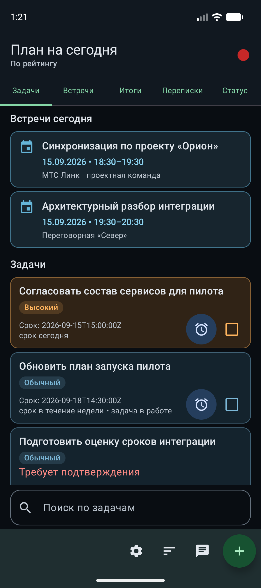](01-tasks.png) | [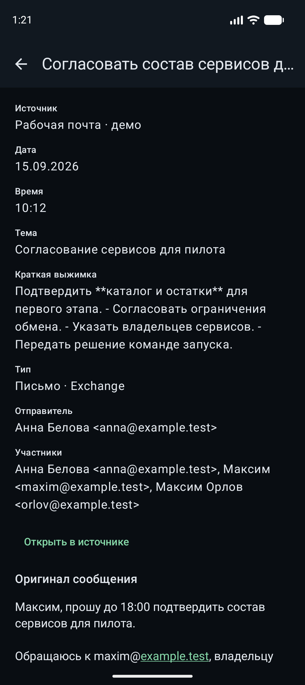](02-task-details.png) | [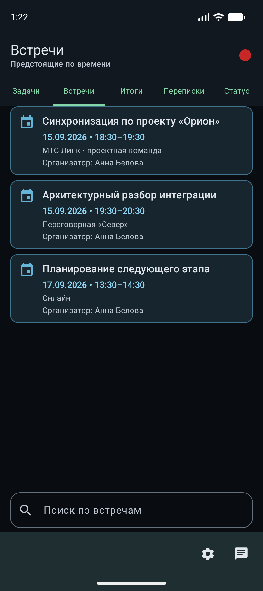](03-meetings.png) |

| Готовый контекст | Будущая встреча | Результаты встреч |
| --- | --- | --- |
| [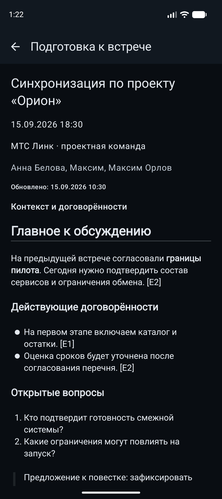](04-meeting-context.png) | [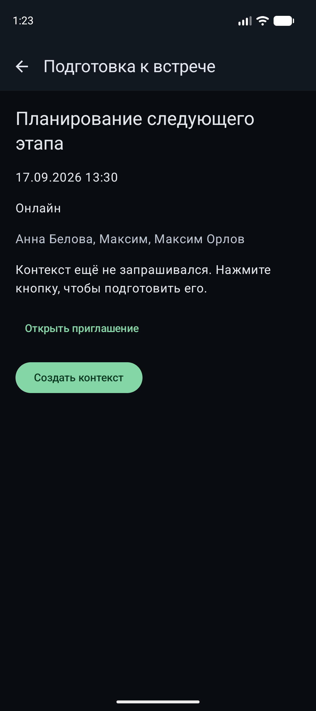](05-future-meeting.png) | [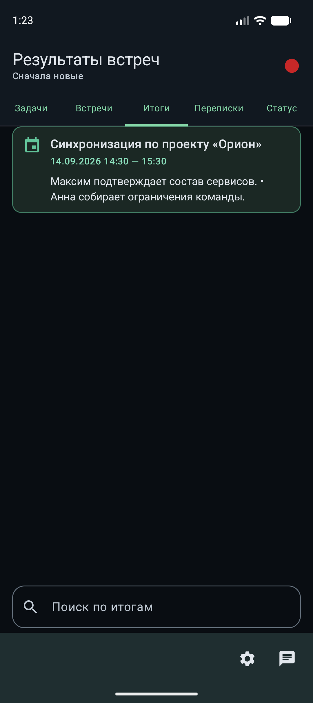](06-meeting-results.png) |

| Детали итогов | Переписки | Детали переписки |
| --- | --- | --- |
| [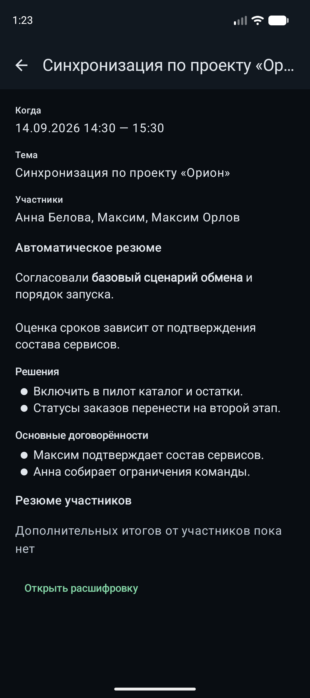](07-result-details.png) | [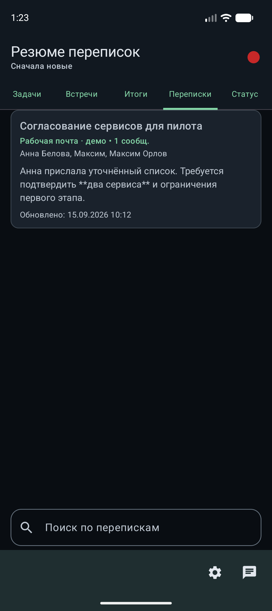](08-threads.png) | [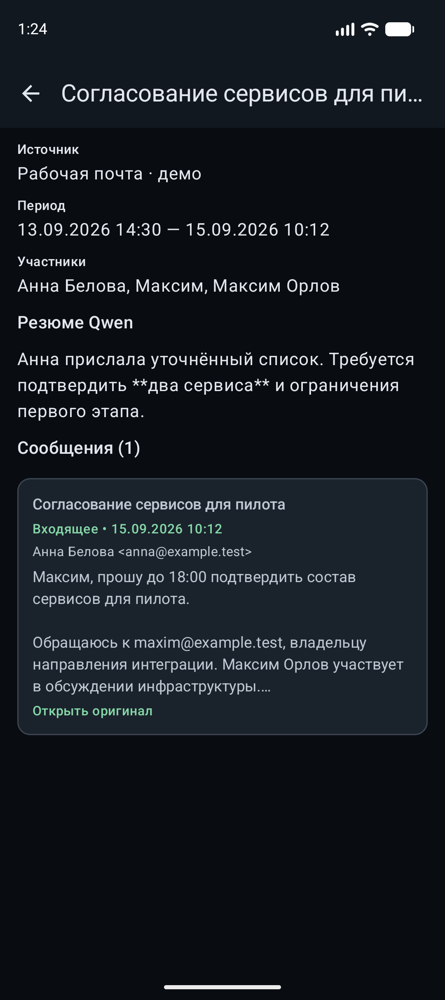](09-thread-details.png) |

| Оригинал сообщения | Чат с Qwen | Состояние компонентов |
| --- | --- | --- |
| [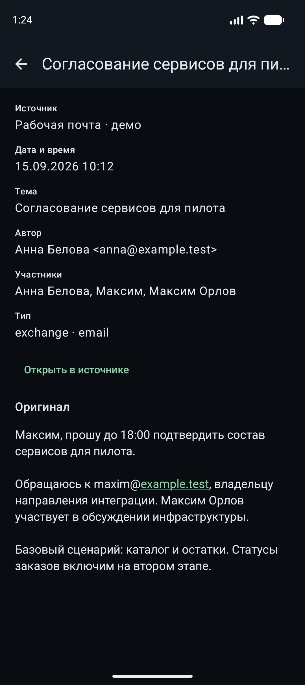](10-message.png) | [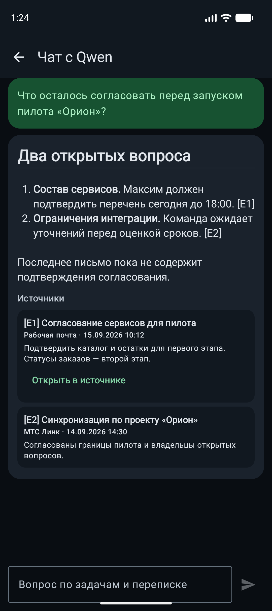](11-qwen-chat.png) | [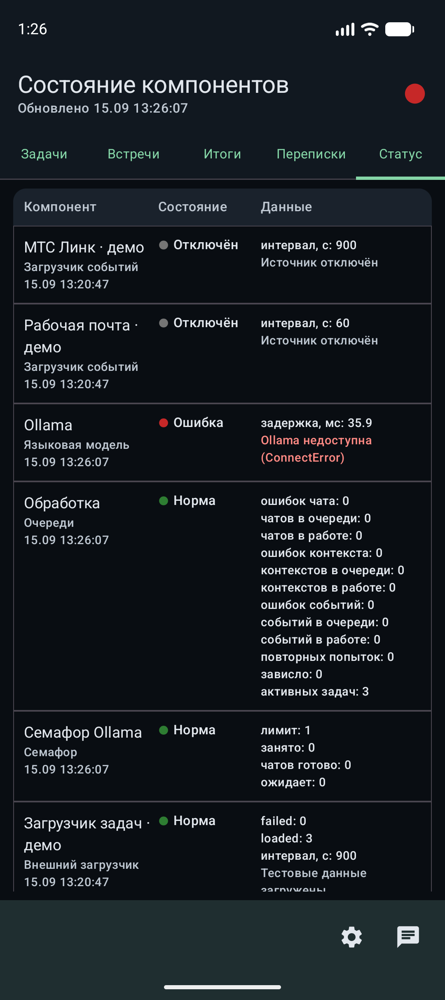](12-system-status.png) |

## Что видно при визуальной проверке

- Подписи пяти вкладок помещаются на экране Pixel 9a.
- Заголовки, выделения и списки Markdown отображаются в контексте встречи,
  итогах встречи и ответе Qwen.
- Будущая встреча без контекста показывает кнопку «Создать контекст».
- В карточках задач срок пока отображается как ISO 8601, например
  `2026-09-15T15:00:00Z`, вместо локальной даты и времени.
- Краткая выжимка задачи, список переписок и резюме переписки пока показывают
  маркеры `**` буквально. Эти места требуют отдельной доработки отображения.

Скриншоты фиксируют текущее состояние приложения. Это визуальная проверка
экранов, а не проверка качества извлечения задач или ответов модели.
